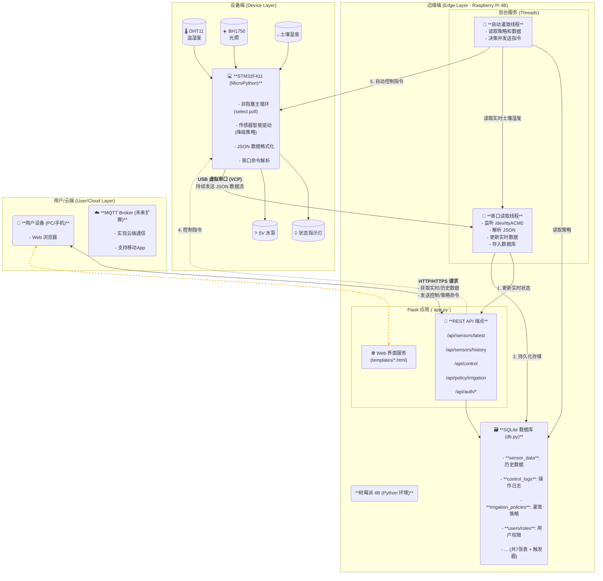

---
type: "always_apply"
---

# 项目名称：基于边缘计算的藏红花全生长周期智能培育系统设计与实现

```
智能科技学院2026届本科毕业设计功能实现要求:

1.软硬件系统设计

可设计移动应用系统、基于智能硬件的应用系统、Web应用系统。

具体要求：

（1）能使用所学C/Python等程序设计语言解决相对复杂的综合问题，目标集中，要有较为完整的主体业务逻辑（总体目标）；

（2）要采用合适的分层架构、视图和代码分离（总体架构）；

（3）要考虑系统所需要的用户界面适配显示效果（前端用户接口UI）；

（4）要使用MySQL/SQLServer/Oracle等数据库持久化的功能，其中移动应用系统、Web应用系统 !!!!重点:至少应包含6张业务逻辑关联数据表!!!!，并涉及到存储过程、触发器等技术点的应用（后端存储）；系统页面须实现响应式设计；整个系统须由前端页面和后台管理系统组成，后台管理系统能区分不同角色入口及对应管理权限；

（5）系统应该设计测试用例，通过测试，能反馈系统的稳定性和健壮性（系统测试），说明软/硬件系统核心功能是否达到预期；

（6）以微控制器（单片机51/STM32，推荐型号STM32L431RCT6，不建议使用型号STM32F103C8T6）为核心的智能应用系统，能够采用微控制器编写程序，实现传感器数据采集、设备终端数据显示、存储，系统应!!!!重点:具有联网功能!!!!、数据通讯、网络控制、数据处理等功能，设备终端硬件需个人独立设计（底板可用面包板设计或PCB设计；各功能模块在底板集成基础上开发并实现对应功能），系统设计时应体现不同方案的对比以及如何完成各器件的选型，设计应贴合具体应用场景，避免同质化套壳设计；

（7）以微处理器（ARM）为核心的智能应用系统，采用ARM处理器编写程序，实现传感器数据采集、设备终端数据显示及存储，系统具有!!!!重点:联网功能!!!!、数据通讯、网络控制、数据处理等功能，设备终端硬件需个人独立设计（底板可用面包板设计或PCB设计；各功能模块在底板上集成基础上开发并实现对应功能），系统设计时应体现不同方案的对比以及如何完成各器件的选型；

（8）智能物联网应用系统，针对特定的应用场景，采用物联网技术，将传感器、控制器、智能设备、互联网等多种物联网组件进行有机结合，实现对各种物品、设备、场所、人员的智能化管理和监控，要求选用合理的物联网中间件技术、系统运行安全稳定可靠，要求设备端硬件需个人独立设计（底板可用面包板设计，或PCB设计；各功能模块在底板上集成基础上开发并实现对应功能），系统设计时应体现不同方案的对比以及如何完成各器件的选型。

(9) !!!!重点:三端互通(移动端,云端,硬件端)!!!!

适用专业：计算机科学与技术（1-7）、智能科学与技术（1-8）、物联网工程（1-8）、信息管理与信息系统（1-5）
知网地址:https://co2.cnki.net/Login.html?dp=tfswufe&r=1685087871577
账户为学号例如:42212346
密码例如:let*********3(星号为加密部分)
```

## 项目核心背景信息 (Project Core Context)

为了方便AI/LLM在后续对话中快速理解上下文，以下是截至当前时间点的项目核心背景信息摘要。

- **项目名称:** 基于边缘计算的藏红花全生长周期智能培育系统设计与实现
- **项目目标:** 设计并实现一个集数据采集、边缘处理、云端通信和跨平台应用控制于一体的完整物联网（IoT）智能农业解决方案。

- **开发者及环境信息:**
  - **开发者操作系统:** **Arch Linux**
  - **直接通过SSH连接树莓派4B进行开发,代码全在树莓派上面,Archlinux通过ssh连接树莓派,树莓派通过USB连接STM32F411黑药丸**
  - **嵌入式IDE:** **STM32CubeIDE**
  - **嵌入式调试工具:** **`minicom`** (串口通信测试)
  - **数据库**: 计划至少 6 张业务表(开发阶段先使用sqlite,如果有精力在更换为更符合题意的Mysql)
  - **附加功能** 手势识别模块控制显示屏模块

- **硬件选型:**
  - **微控制器 (MCU):** **WeAct STM32F411CEU6 "黑药丸"** (WeAct官方旗舰店购买)
  - **开发环境:** **MicroPython v1.26.1** (官方固件)
  - **边缘计算设备:** **树莓派4B (Raspberry Pi 4B)**
  - **不要使用python3 Saffron_Edge_Server/app.py来运行我的项目我的项目有独立的运行脚本:Saffron_STM32_Core/deploy_final.sh**

- **请注意开发与测试阶段数据库(开发阶段先使用sqlite,如果有精力在更换为更符合题意的Mysql)和Flask Web服务都先在树莓派4B上,部署与生产阶段将数据库和Flask Web服务器都移植到云服务器**
- **已安装以下固件MicroPython固件(我购买的黑药丸版本非默认发货板,而是已焊接焊Flash(8MB)+焊排针(向下)-立芯的版本)**
  Firmware (v3.1 board with 8MB SPI Flash)
  Releases
  v1.26.1 (2025-09-11) .dfu / [.hex] / [Release notes] (latest)

已有的硬件:
以下是我已有的硬件的列表,如果需要另外的硬件请提出来我额外网购(全部是刚来物联网专业时开学前一股脑花300元买的(除了树莓派和NUCLEO),只不过大部分我都不会用,我的嵌入式硬件功底很差所以毕业项目硬件部分应该以简单为主,如果有更简单的请推荐我买更简单的)
```python
["面包板(MB-102)x2和配套的面包板电源x2","树莓派4B","电阻一大把,杜邦线一大堆,面包板一个,LED一堆,几个逻辑芯片,一些杂七杂八的小玩意例如电容,按钮等.","esp-12F model esp8266MOD CH340 Driver","HW-028","HW-139","HW-072","HW-61","HW-478","HW-095","DHT11","MH-FMD Low level trigger","Tracker Sensor","Relay model TONGLING 5VDC 10A 250VAC 15A 125VAC 10A 220VAC JQC-3FF-S-Z 1路光耦隔离继电器驱动模块支持高/低电平触发","HW-389 NodeMcu Ver 1.0","LCD9648 普中科技 www.prechin.cn","MH-Sensor-series","MH_Electronic","MH-Real-Time Clock modules","Water Sensor","MQ Sensor Flying Fish MQ-2","RFID-RC522","HC-SR04","HW-103 v0.1","5011AS","5161BS","马达x3(有不同的样子)和风扇","还要个类似马达的东西:STEP MOTOR 28BYJ-48 5V DC 2405005728","9V电池两个","Grayscale Sensor","Tower Pro Micro Servo 9g SG90","ULN2003 步进电机驱动板","电位器","土壤湿度检测(REMOVE SEAL AFTER WASHING)","Hall Effect Sensor Module","Passive Infrared Sensor","WS2812B RGB LED","声音传感器模块","激光二极管模块","蓝牙模块","蜂鸣器","TCRT5000 反射式光电传感器","ESP-01 wifi","倾斜传感器模块","紫色,红色,绿色的假花","26cm _ 19cm _ 14cm的亚克力箱子(带盖)","12cm _ 12cm _ 12cm的亚克力花盆","迷你打孔机","一个塑料瓶子(当作物的水库)","塑料逆止阀","LED灯带5V","带线防水探头DS18B20测温检测","电容式土壤湿度传感器模块","GY-302 数字光强度 光照传感器","MOS场效应管电子开关控制模块 脉冲触发板 DC直流 带光耦隔离","1N5819 1A 40V (20个)","树莓派USB免装驱动摄像头"]
```
## 架构图


